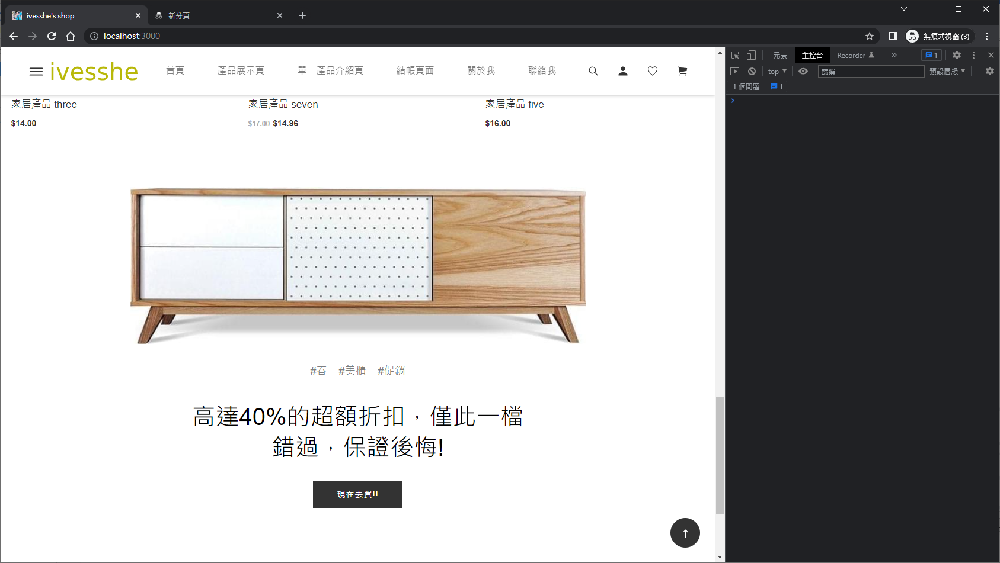

# React 電商前台 搭配Next.js

# 使用技術

- react
- react-redux
- Next.js
- react-bootstrap
- sass

# 頁面展示

首頁-上


首頁-中


首頁-下



首頁-footer


商品展示頁


單一產品介紹頁


結帳頁面


關於我


聯絡我


客戶登入頁


願望清單


購物車


# Next.js

https://nextjs.org/


https://nextjs.org/learn/basics/create-nextjs-app/setup

```bash
npx create-next-app nextjs-blog --use-npm --example "https://github.com/vercel/next-learn/tree/master/basics/learn-starter"

```

# Next.js Note

## official Next.js examples

https://github.com/vercel/next.js/tree/canary/examples

## blog-starter

https://github.com/vercel/next.js/tree/canary/examples/blog-starter

```bash
npx create-next-app --example blog-starter blog-starter-app
```

## create-next-app

https://www.npmjs.com/package/create-next-app


## Facebook SDK for JavaScript

https://developers.facebook.com/docs/javascript/quickstart


## Script Component

https://nextjs.org/docs/basic-features/script

There are three different loading strategies that can be used:

beforeInteractive: Load before the page is interactive
afterInteractive: (default) Load immediately after the page becomes interactive
lazyOnload: Load during idle time
worker: (experimental) Load in a web worker

```html
<Script src="https://connect.facebook.net/en_US/sdk.js" strategy="lazyOnload" />
```

## Global Styles

https://nextjs.org/learn/basics/assets-metadata-css/global-styles

To load global CSS files, create a file called pages/_app.js with the following content:

```js
export default function App({ Component, pageProps }) {
  return <Component {...pageProps} />
}
```

## Pre-rendering and Data Fetching

https://nextjs.org/learn/basics/data-fetching/two-forms


getStaticProps
 
```js
export default function Home(props) { ... }

export async function getStaticProps() {
  // Get external data from the file system, API, DB, etc.
  const data = ...

  // The value of the `props` key will be
  //  passed to the `Home` component
  return {
    props: ...
  }
}
```

## Implement getStaticProps

```bash
npm install gray-matter
```

```js
import fs from 'fs'
import path from 'path'
import matter from 'gray-matter'

const postsDirectory = path.join(process.cwd(), 'posts')

export function getSortedPostsData() {
  // Get file names under /posts
  const fileNames = fs.readdirSync(postsDirectory)
  const allPostsData = fileNames.map(fileName => {
    // Remove ".md" from file name to get id
    const id = fileName.replace(/\.md$/, '')

    // Read markdown file as string
    const fullPath = path.join(postsDirectory, fileName)
    const fileContents = fs.readFileSync(fullPath, 'utf8')

    // Use gray-matter to parse the post metadata section
    const matterResult = matter(fileContents)

    // Combine the data with the id
    return {
      id,
      ...matterResult.data
    }
  })
  // Sort posts by date
  return allPostsData.sort(({ date: a }, { date: b }) => {
    if (a < b) {
      return 1
    } else if (a > b) {
      return -1
    } else {
      return 0
    }
  })
}
```

## Incremental Static Regeneration

https://vercel.com/docs/concepts/next.js/incremental-static-regeneration

```js
// pages/products/[id].js

export async function getStaticProps({ params }) {
  return {
    props: {
      product: await getProductFromDatabase(params.id),
    },
    revalidate: 60,
  };
}
```

## Page Path Depends on External Data

https://nextjs.org/learn/basics/dynamic-routes/page-path-external-data


```bash
npx create-next-app nextjs-blog --use-npm --example "https://github.com/vercel/next-learn/tree/master/basics/dynamic-routes-starter"

npx create-next-app dynamic-routes --use-npm --example "https://github.com/vercel/next-learn/tree/master/basics/dynamic-routes-starter"
```

## Data Fetching Overview

https://nextjs.org/docs/basic-features/data-fetching/overview#fallback-false

## next Templates

https://themeforest.net/search/next

## next deploy

- Github
- Vercel
https://vercel.com/ 
